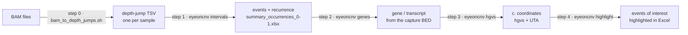

# EyeOnCNV

[](LICENSE)


**Finding the small copy-number events that bin-based callers miss, without reviewing
every BAM by eye.**

Most CNV detection algorithms bin coverage before calling copy-number changes, so
biologists are left opening BAM files and looking by eye for the events those algorithms
may have missed. The critical window, where such events go undetected, lies roughly
between 30 and 100 bp. Reviewing every BAM this way stops being practical as soon as the
number of samples grows.

EyeOnCNV does that reading for you, on all the BAM files it is given. Its principle is
empirical: after observing many deletions and duplications by hand, we noticed that what
the eye follows is a step - upwards or downwards - at each edge of the event. The
algorithm looks for the same thing: the rise or the fall of coverage from one base to the
next.

In practice it follows read depth base by base inside the capture design, keeps the
positions where depth steps up or down, pairs them into events, drops the ones that recur
across samples (artefacts), and returns an Excel table annotated with the gene, the
transcript and the c. coordinates, where the events worth reviewing are highlighted.

> [!IMPORTANT]
> Research and laboratory tool, not a medical device. Every event must be checked
> (e.g. in IGV) and confirmed with an orthogonal method before any clinical use.
> Never commit patient data to this repository.

## How it works



| Step | Command | What it does |
|---|---|---|
| 0 | `scripts/bam_to_depth_jumps.sh` | `samtools depth` inside the capture BED; keeps pairs of consecutive positions whose depth changes by ≥ 15 % (≥ 30 % below 150x), then drops isolated positions. |
| 1 | `eyeoncnv intervals` | Groups positions into events (start, end, deletion/duplication) and counts in how many other samples - including previous runs - each event is found. |
| 2 | `eyeoncnv genes` | Adds the name of the overlapping BED regions (`GENE-NMxxxxxx`). |
| 3 | `eyeoncnv hgvs` | Projects the start and end of each event on the transcript (`c.467`, `c.467+5`...). Needs network access. |
| 4 | `eyeoncnv highlight` | Flags events of ≥ 3 bp whose c. start is in the coding sequence and fills them in yellow. |

`eyeoncnv run` chains steps 1 to 4. The method, the parameters and their rationale are
described in [docs/small-events-pipeline.md](docs/small-events-pipeline.md).

## Installation

Clone or download the repository, then from its folder:

```bash
# recommended: conda (installs samtools and the hgvs dependencies)
conda env create -f environment.yml
conda activate eyeoncnv

# or: pip (samtools must then be installed separately)
pip install -e .            # steps 0-2 and 4
pip install -e ".[hgvs]"    # + step 3 (macOS / Linux / WSL)
```

Requirements: Python ≥ 3.10, samtools ≥ 1.10 and bash for step 0. Step 3 relies on the
[hgvs](https://github.com/biocommons/hgvs) package, which does not install on native
Windows. Details, Windows notes and the UTA database: [docs/installation.md](docs/installation.md).

## Quick start (synthetic example, no patient data)

```bash
# step 0 - needs samtools: build 3 toy BAM files, then extract the depth jumps
python examples/make_example_bams.py
bash scripts/bam_to_depth_jumps.sh \
    --bed examples/small_events/panel_demo.bed \
    --in-dir examples/small_events/bam \
    --out-dir results/tsv

# steps 1-4 (the expected TSV files are also provided in examples/small_events/tsv)
eyeoncnv run results/tsv --bed examples/small_events/panel_demo.bed --out-dir results
```

Open `results/summary_occurrences_0-1_genes_highlight.xlsx`: the artefact shared by the
three samples is gone, the 2-bp event is not highlighted, the other events are. The
demo transcripts are fictitious, so step 3 is skipped here (no `--nm-map`).

## Usage on real data

```bash
# step 0 - every BAM of a folder (a .bai index is created when missing)
bash scripts/bam_to_depth_jumps.sh --bed design_Covered.bed --in-dir bams/ --out-dir tsv/

# steps 1-4 at once
eyeoncnv run tsv/ --bed design_Covered.bed --nm-map transcripts.xlsx --out-dir results/

# ... or step by step
eyeoncnv intervals tsv/ --out-dir results/
eyeoncnv genes results/summary_occurrences_0-1.xlsx --bed design_Covered.bed
eyeoncnv hgvs results/summary_occurrences_0-1_genes.xlsx --nm-map transcripts.xlsx
eyeoncnv highlight results/summary_occurrences_0-1_genes_hgvs.xlsx
```

- The transcript table (`--nm-map`) has two columns, `genes` and `NM` (e.g. `BRCA2` /
  `NM_000059.4`); it gives the version of each transcript.
- The per-sample files `<sample>_intervals_with_variation.xlsx` accumulate in the output
  folder: later runs count them in the recurrence, so artefacts are recognised better
  as samples are added (`--history-dir` to use another folder, `--no-history` to disable).
- `eyeoncnv <command> --help` lists every option. All files are described in
  [docs/file-formats.md](docs/file-formats.md).

The same steps are available from Python or Jupyter:

```python
from eyeoncnv.pipeline import run_pipeline

result = run_pipeline(["tsv/"], "results/", bed="design_Covered.bed", transcript_map="transcripts.xlsx")
print(result.final)
```

## Repository layout

```
scripts/bam_to_depth_jumps.sh   step 0 (bash + samtools + awk)
src/eyeoncnv/              Python package and `eyeoncnv` command
    intervals.py  genes.py  hgvs_coords.py  highlight.py  pipeline.py  cli.py  common.py
examples/                       synthetic data (toy BAM generator, TSV, BED, transcript table)
docs/                           installation, method, file formats, changes
tests/                          pytest suite (run: pytest)
```

## Development

```bash
pip install -e ".[dev]"
pytest          # includes the bash script, run with every awk implementation found
ruff check .
```

This code replaces the notebook `CNV_eye_of_medah.ipynb` and the command lines of
`Read_me_cnv_petit_evenement.docx`; what changed is listed in
[docs/changes-from-notebooks.md](docs/changes-from-notebooks.md).

## License and author

MIT - see [LICENSE](LICENSE). Written by Lotfi Otmane.
